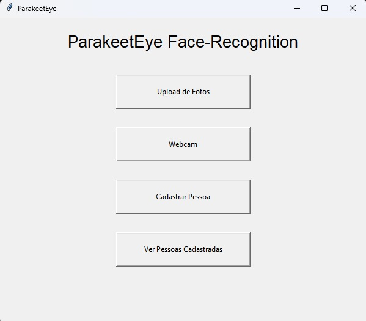

# 🦜 ParakeetEye

**Real-time Facial Recognition System with Liveness Detection**

ParakeetEye is a real-time facial recognition system built in Python, featuring advanced liveness detection (anti-photo/spoofing), dynamic user registration, and a complete graphical interface.

---

## Features

-  Real-time facial recognition via webcam
-  Image upload for face identification
-  User registration with liveness detection (movement + texture analysis)
-  List of registered users with sample count
-  Delete users directly from the graphical interface
-  Protection against printed photos, screens, and static images
-  Persistent local database using facial encodings

---

## Technologies

- **Python**
- **face_recognition** (dlib-based deep learning)
- **OpenCV**
- **Tkinter** (GUI)
- **NumPy**

---

## Interface



---

## RealTime Recogntion


---
##  Installation & Usage

```bash
### 1. Clone the repository

git clone https://github.com/CavalodeCombate123/ParakeetEye.git
cd ParakeetEye 

### 2. Install dependencies
pip install -r requirements.txt

### 3. (Optional) Initialize database from dataset/ folder
python scripts/BootData.py

### 4. Run the application
python scripts/main.py
```

---

## Project Structure

```bash
ParakeetEye/
├── .gitignore
├── README.md
├── requirements.txt
│
├── assets/
│   ├── Interface.jpg
│   └── teste.gif
│
├── data/
│   ├── encodings.npy
│   └── nomes.npy
│
├── dataset/                 # (Optional)
│
├── docs/
│   └── ParakeetEye.docx
│
└── scripts/
    ├── main.py
    ├── operations.py
    ├── face_processing.py
    ├── database.py
    ├── image_utils.py
    ├── constants.py
    └── BootData.py
```

---

## How It Works

The system uses the face_recognition library to extract 128-dimensional facial encodings.
During operation:

Faces are detected and encoded in real time
Encodings are compared using Euclidean distance
Liveness detection (Laplacian variance + movement analysis) prevents spoofing attacks
All data is stored locally in .npy files for fast access

## Important Notes

Recognition accuracy depends on lighting conditions and image quality
Recognition threshold: 0.6
The project was fully modularized for better maintainability and future scalability

## Future Improvements

Attendance system with date/time logging
Enhanced graphical interface (PyQt or custom Tkinter)
Support for multiple profiles per person
SQLite database integration
Cloud synchronization

## Developed with for learning and practical application of Computer Vision.
## Feel free to contribute, suggest improvements, or reach out!
